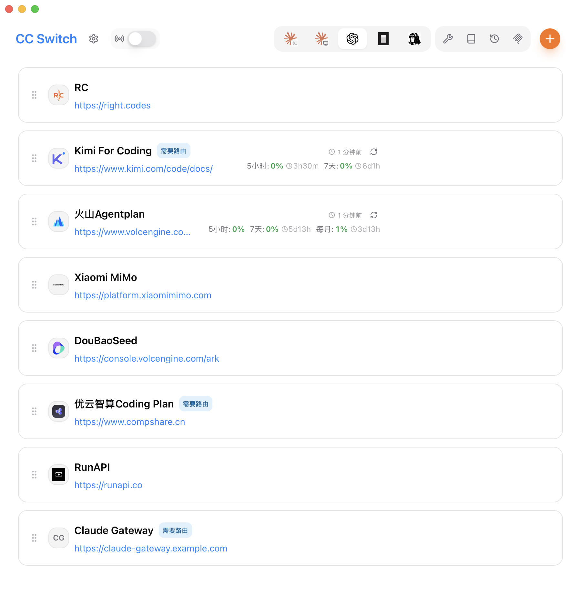
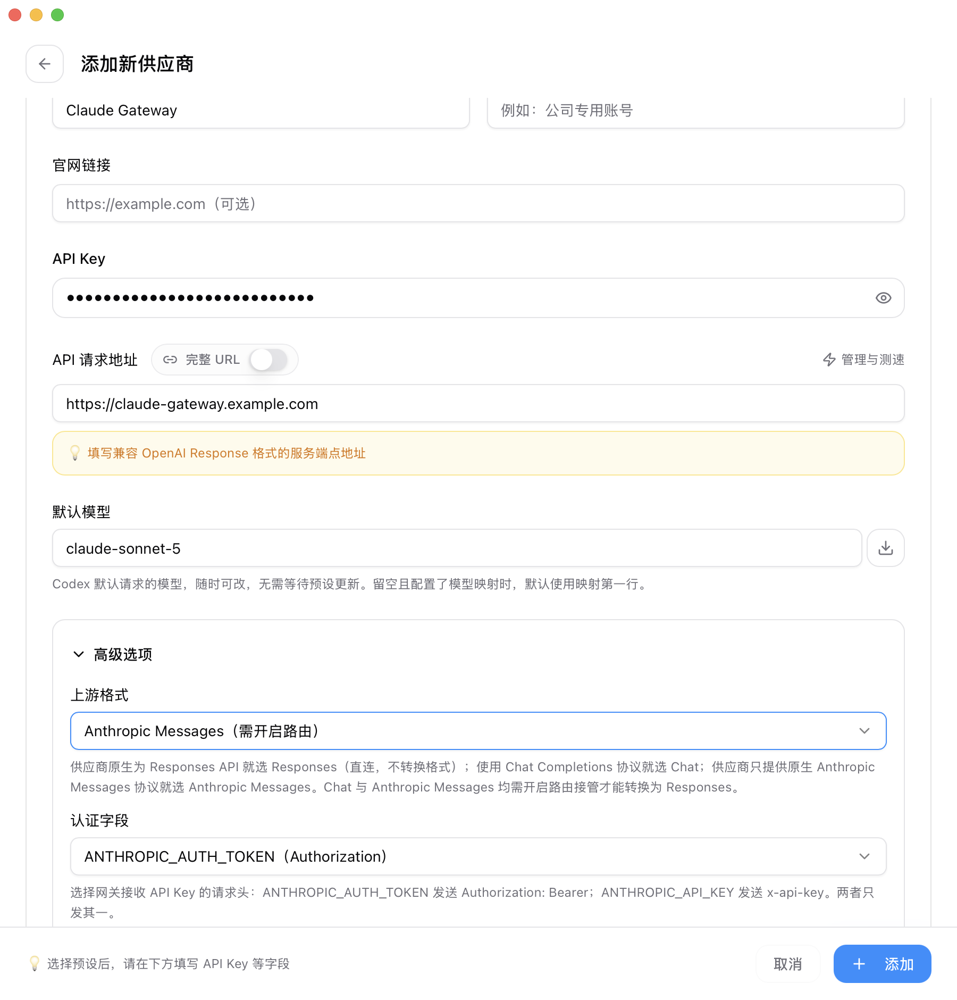
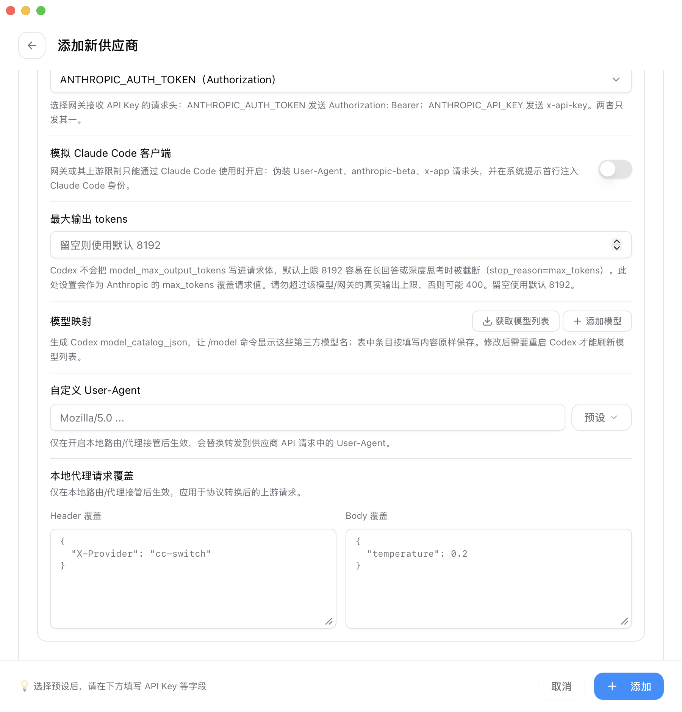
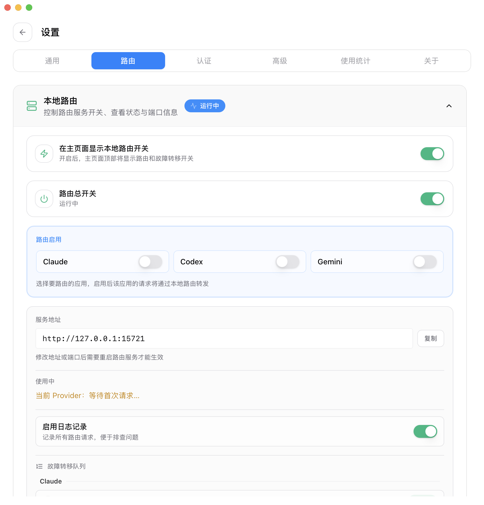

# Codex で Claude を使う: CC Switch ローカルルーティングガイド

> 対象バージョン: CC Switch 3.17.0 以降（「Anthropic Messages 上流」は 3.17.0 から導入）。本記事はリポジトリ内のドキュメントとコードをもとに整理し、Claude 系中継ゲートウェイを例に説明します。スクリーンショットは現在のフロントエンド UI から、実際の API Key が漏れないよう匿名化したサンプルデータで生成しています。

## ローカルルーティングが必要な理由

新しい Codex CLI は OpenAI Responses API を前提にしています。一方で各種 Claude 系中継ゲートウェイや企業内部ゲートウェイが公開しているのは Anthropic Messages プロトコル、つまり `/v1/messages` です。この 2 つのプロトコルは、リクエストボディ、ストリーミングイベント、レスポンス構造がまったく異なります。この種のゲートウェイのエンドポイントをそのまま Codex 設定に入れても、`/responses` へのリクエストが 404 になるだけです。

この機能は「手元にあるのが `/v1/messages` エンドポイントだけ」という場面のためのものです。ある Claude 系中継ゲートウェイの Key を持っていて、Codex の操作感で Claude 系モデルを使いたい。あるいは会社がコンプライアンス方針で Claude Code クライアントを禁止し、承認済みの Claude 系ゲートウェイだけを残している——モデル自体は利用できるのに、許可されたクライアントがないだけです。その空白を Codex で埋められます。

CC Switch では、Codex が常にローカルルートへ接続し、Responses API のままリクエストを送るようにします。ルートは現在のプロバイダーが Anthropic 形式だと判定すると、リクエストを Anthropic Messages に変換して上流へ送り、最後にレスポンスを Responses 形式へ戻して Codex に返します。

この経路は主に 4 つのステップに分かれます：

1. Codex を引き継ぐと、ローカル設定は `http://127.0.0.1:15721/v1` に書き換えられ、`wire_api = "responses"` が強制的に維持されます。
2. プロバイダーの上流フォーマット `anthropic` が、実際の上流は Anthropic Messages プロトコルだとルートに伝えます。
3. ルートは `/responses` を `/v1/messages` に書き換え、Responses のリクエストボディを Anthropic のリクエストボディへ変換します。
4. 上流から返ってきた後、ルートは Anthropic の JSON または SSE を Codex が理解できる Responses JSON/SSE へ変換して返します——推論内容、ツール呼び出し、画像もすべて変換対象です。

## 事前準備

先に次の 3 つを用意してください：

- インストール済みで起動できる CC Switch（3.17.0 以降）。
- インストール済みの Codex CLI。少なくとも 1 回は実行し、`~/.codex/` のディレクトリ構造が存在していること。
- Anthropic Messages プロトコルのエンドポイント（`/v1/messages`）へアクセスできる API Key——ある Claude 系中継ゲートウェイ、または企業内部の Claude ゲートウェイのもの。エンドポイントと認証方式はゲートウェイのドキュメントに従ってください。注意：一部のプロバイダーは Claude API を Claude Code 内でのみ利用できるよう制限しており、この種の Key を Codex で使うとエラーになることがあります。判断がつかない場合は、先にプロバイダーへ問い合わせてください。

Codex タブには現時点で Anthropic の内蔵プリセットがないため、以下では「カスタム設定」の手順で進めます。入力する項目は全体でも 4〜5 個です。

## Step 1: Codex プロバイダーを追加する

CC Switch を開き、上部の `Codex` タブへ切り替え、右上のプラスボタンからプロバイダーを追加します。デフォルトの `カスタム設定` のまま、次の項目を入力します：

- **プロバイダー名**: 任意です。たとえば `Claude Gateway`。
- **API Key**: あなたのゲートウェイの Key。実際の Key は CC Switch 内にのみ保存され、ローカルルートが転送時に注入するため、Codex の live 設定には入りません。
- **API エンドポイント**: ゲートウェイのルートアドレスを入力すれば十分です。たとえば `https://claude-gateway.example.com`。`/v1` は付けても付けなくても正しく処理され、ルートが自動的に `/v1/messages` へリクエストを送ります。自分で `/v1/messages` を組み立てないでください（ゲートウェイのドキュメントが完全な messages URL を指定している場合は、隣の `フル URL` スイッチをオンにしてそのまま貼り付けても構いません）。アドレス欄の下に表示される「OpenAI Response 互換」という黄色のヒントは Responses 直結向けの汎用文言です。Anthropic フォーマットを選ぶ場合は本記事のとおりに入力してください。
- **デフォルトモデル**: ゲートウェイが認識する Claude モデル ID を入力します。たとえば `claude-sonnet-5`。ゲートウェイのドキュメントにあるモデル名に従ってください。

続いて `高級オプション` を展開し、`上流フォーマット` をデフォルトの `Responses（ネイティブ）` から **`Anthropic Messages（ルーティング必須）`** に変更します。

Anthropic Messages を選ぶと、下に 3 つの関連フィールドが追加で表示されます：

- **認証フィールド**: API Key をどのヘッダーで上流へ送るかを決めます。送信されるのはどちらか一方のみで、ゲートウェイのドキュメントに従って選びます。
  - `ANTHROPIC_AUTH_TOKEN（Authorization）`: `Authorization: Bearer <key>` を送信します。デフォルト値で、多くの Claude 系中継ゲートウェイがこの方式を使います。
  - `ANTHROPIC_API_KEY（x-api-key）`: `x-api-key: <key>` を送信します。Anthropic ネイティブのヘッダー規約を踏襲する一部のゲートウェイはこちらを要求します。選択を誤ると、通常 401 / 403 という形で現れます。
- **Claude Code クライアントを模倣**: デフォルトはオフです。ゲートウェイ（またはその上流）が「Claude Code からのみ利用可能」と制限している場合にのみオンにします。オンにすると User-Agent・`anthropic-beta`・`x-app` ヘッダーを偽装し、システムプロンプトの先頭行に Claude Code のアイデンティティを注入します。通常のゲートウェイでは不要です。オンにしても拒否される場合の対処は「よくある質問」を参照してください。
- **最大出力トークン**: Anthropic プロトコルの `max_tokens` は必須項目です。Codex のリクエストが出力上限を含まない場合、ルートは保守的に 8192 で補います。長い回答や深い思考では切り詰められることがあります（回答が不完全になる、`stop_reason=max_tokens` になる、といった形で現れます）。切り詰められたら、ここでモデルの実際の上限に合わせて引き上げてください。ただし超えないように——超えると上流が直接 400 を返します。

同じエリアの `モデルマッピング` は任意です。`claude-opus-4-8`、`claude-sonnet-5`、`claude-haiku-4-5-20251001` のようなモデル ID（上流が認識する名前に従ってください）を 1 行ずつ追加すると、CC Switch がモデルカタログを生成し、Codex の `/model` メニューに一覧表示できるようになります。入力しなくても利用でき、その場合 Codex はデフォルトモデルを直接リクエストします。

プロバイダーを保存すると、カードに `ルーティングが必要` のマークが表示されます——この種のプロバイダーは、ローカルルーティングが実行中でなければ正しく動作しません。

## Step 2: ローカルルーティングを有効にして Codex をルーティングする

設定の `ルーティング` ページに入り、`ローカルルーティング` を展開して、2 つのスイッチを設定します：

1. `ルーティング総スイッチ` をオンにしてローカルサービスを起動します（初回起動時は説明の確認ダイアログが表示されます）。デフォルトアドレスは `127.0.0.1:15721` です。
2. `ルーティング有効` で `Codex` をオンにします。Codex だけをルーティングしたい場合は、Claude と Gemini はオフのままで構いません。

引き継ぎ後、CC Switch は Codex の live 設定をローカルルートへ向け（`base_url = http://127.0.0.1:15721/v1`）、`auth.json` にはプレースホルダーだけが入ります。実際の Claude Key は CC Switch のプロバイダー設定内に残り、ローカルルートが転送時に、あなたが選んだ認証フィールドに従って注入します。

## Step 3: プロバイダーを切り替えて Codex を再起動する

Codex プロバイダー一覧に戻り、Claude プロバイダーの `有効化` をクリックします。ルーティングが実行されていない場合、CC Switch は「このプロバイダーは Anthropic Messages API フォーマットを使用しており、ルーティングサービスが必要です。先にルーティングを起動してください」と表示します——Step 2 に戻ってオンにすれば解決します。

切り替え後は、現在の Codex ターミナルセッションを再起動することをおすすめします。`config.toml` とモデルカタログは Codex プロセスの起動時に読み込まれるため、実行中のプロセスがホットロードするとは限りません。

Codex に入ったら、段階的に確認できます：

- モデルマッピングを設定している場合は、`/model` で Claude モデルがメニューに表示されているか確認します。マッピングを設定していない場合、Codex はデフォルトモデルを直接使います。
- 小さな質問を 1 つ送り、設定 → ルーティングページの「現在のプロバイダー」が「最初のリクエスト待ち」からあなたの Claude プロバイダーに変わり、「総リクエスト数」が増え始めるのを確認します。
- 使用量ダッシュボードでは、これらのリクエストのモデル名が `claude-*` としてそのまま表示され、プロバイダーで絞り込んで token 使用量を照合できます。

## 機能の範囲と既知の制限

- **プロンプトキャッシュが自動で有効**: 変換ブリッジは Anthropic 標準に従って 5 分のプロンプトキャッシュマーカー（システムプロンプト、ツール定義、対話履歴）を注入します。長い対話でも毎回全額で再送されることはなく、設定は不要です。
- **推論とツールを無損失で往復**: extended thinking の内容はブリッジをまたいで往復しても保持され、複数ターンのツール呼び出し、画像、PDF 入力も完全に変換されます。
- **`[1m]` 長コンテキストマーカーに対応**: デフォルトモデルやモデルマッピングのモデル ID が `[1m]` で終わる場合（例：`claude-sonnet-5[1m]`）、ルートはマーカーを取り除き、対応する 1M コンテキストの beta ヘッダーを自動で補います。ただし、ゲートウェイがその機能に対応していることが前提です。
- **Web 検索は利用不可**: Anthropic 上流モードでは Codex の内蔵 `web_search` が意図的に無効化されます——変換層が Anthropic エンドポイントへ翻訳できないためで、必ず失敗するツールをモデルに提示しないための措置です。
- **切り詰めをそのまま報告**: 上流が出力上限で止まったりストリームが切断されたりすると、Codex は偽装された成功ではなく「未完了」を受け取ります。これにより気づきやすくなり、最大出力トークンを引き上げる判断ができます。

## よくある質問

**上流が 401 または 403 を返す**

ほとんどの場合、認証フィールドがゲートウェイの要求と一致していません。`ANTHROPIC_AUTH_TOKEN（Authorization）` と `ANTHROPIC_API_KEY（x-api-key）` を、ゲートウェイのドキュメントに従って切り替えて再試行してください（多くのゲートウェイはデフォルトの Bearer です）。あわせて、Key 自体が有効で残高があることも確認してください。

**Codex が 404 を返す、または `/responses` が見つからない**

多くの場合、Codex のルーティング引き継ぎが有効になっていないか、ゲートウェイのエンドポイントを手動で Codex に直接書いています——Anthropic プロトコルの上流には `/responses` エンドポイントが存在しないため、必ず 404 になります。`~/.codex/config.toml` の現在の provider の `base_url` が `http://127.0.0.1:15721/v1` を指しているか確認してください。

**上流が 404 を返す（ルーティングは有効）**

API エンドポイントを確認してください。ゲートウェイのルートアドレスであるべきで、`/chat/completions` のような別プロトコルのパスが付いたアドレスではいけません。ゲートウェイのパスが特殊な場合は、`フル URL` スイッチを使って完全な messages エンドポイントをそのまま貼り付けてください。

**回答が途中で切り詰められることが多い**

これはデフォルトの 8192 出力上限の現れです。プロバイダーフォームの高級オプションにある `最大出力トークン` で引き上げ（モデル / ゲートウェイの実際の上限を超えないように）、保存してから再試行してください。

**`/model` に Claude モデルが表示されない**

モデルマッピングにエントリが追加されていることを確認し、プロバイダーを保存してから Codex を再起動してください——モデルカタログは実行中のプロセスにはホットロードされません。デフォルトモデルがマッピングに含まれていない場合、メニューには表示されませんが、直接リクエストは有効です。

**Web 検索が使えない**

仕様どおりです。「機能の範囲と既知の制限」を参照してください。Web 検索が必要なタスクは、Responses / Chat フォーマットのプロバイダーへ切り替えることをおすすめします。

**Claude Code でしか使えないというエラーが出る**

一部のプロバイダーは、その Claude API を Claude Code クライアント内でのみ利用できるよう制限しており、本ガイドの経路で Codex から使うと拒否されます。高級オプションの `Claude Code クライアントを模倣` スイッチをオンにして試すことはできますが、それでもエラーになる場合、制限はプロバイダーのサーバー側にあります。その Key を Claude Code 以外で使えるかどうか、プロバイダーへ問い合わせて確認してください。通常のゲートウェイでは、このスイッチはオフのままにしてください。

## コンプライアンスに関する注意

「会社がクライアントを禁止し、ゲートウェイだけを残している」という場面で使う前に、この使い方が所属組織の具体的な方針に沿っているかを確認することをおすすめします——禁止されているのが特定のクライアントなのか、それともある種の利用方法なのかは、組織によって解釈が異なります。サードパーティ中継ゲートウェイを使う場合は、対象ゲートウェイの課金・コンプライアンス・データ保持に関する規約を必ずお読みください。

## 参考リンク

- [CC Switch ユーザーマニュアル: プロキシサービス](../user-manual/ja/4-proxy/4.1-service.md)
- [CC Switch ユーザーマニュアル: アプリケーションルーティング](../user-manual/ja/4-proxy/4.2-routing.md)
- [CC Switch v3.17.0 リリースノート](../release-notes/v3.17.0-ja.md)
- この機能はコミュニティからの貢献 [#5071](https://github.com/farion1231/cc-switch/pull/5071) によるものです。@yeeyzy に感謝します。
