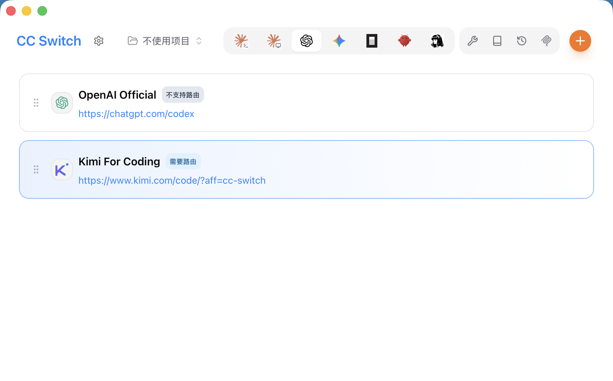
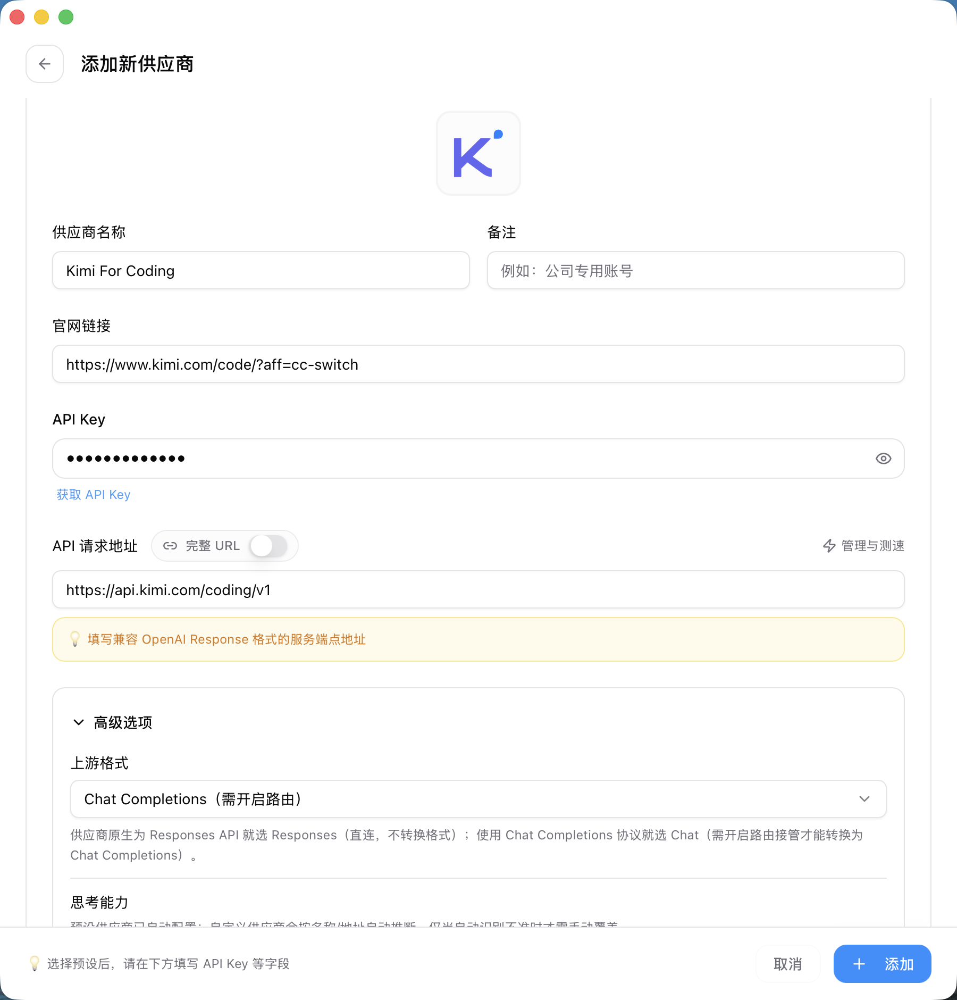
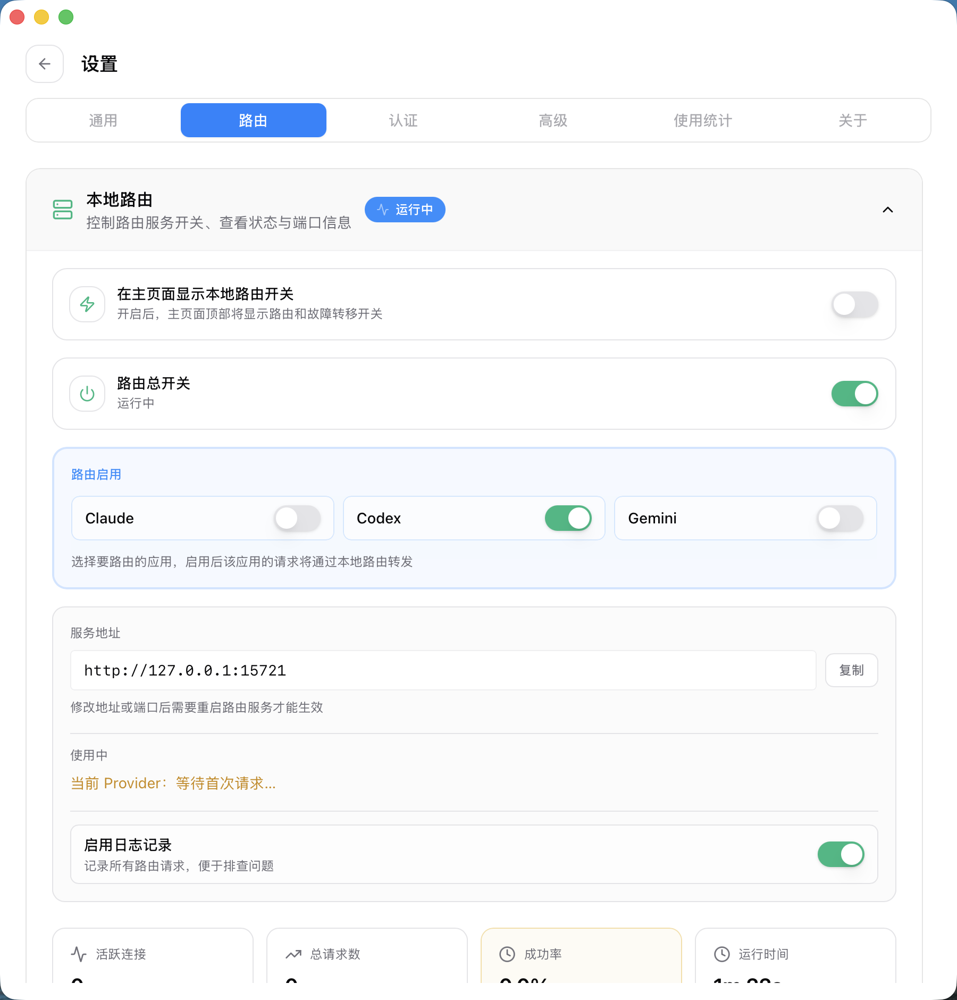

# Codex で Kimi を使う: CC Switch ローカルルーティングガイド

> 対象バージョン: CC Switch 3.16.5 およびその前後のバージョン。本記事はリポジトリ内のドキュメントとコードをもとに整理し、OpenAI Chat Completions 互換 API の例として Kimi を使用します。スクリーンショットは現在のフロントエンド UI から、実際の API Key やアカウント残高が漏れないよう匿名化したサンプルデータで生成しています。

## ローカルルーティングが必要な理由

新しい Codex CLI は OpenAI Responses API を前提にしています。一方で Kimi オープンプラットフォームと Kimi For Coding が実際に公開しているのは、いずれも OpenAI Chat Completions 形式、つまり `/chat/completions` です。この 2 つのプロトコルは、リクエストボディ、ストリーミングイベント、レスポンス構造が異なります。Kimi のエンドポイントをそのまま Codex 設定に入れると、`/responses` へのリクエストが 404 になる、ストリーミングレスポンスを Codex が正しく解析できない、といった問題が起きがちです。

Kimi For Coding が公式にサポートするサードパーティツールは、Claude Code や Roo Code など Anthropic 互換のコーディング Agent であり、Codex はリストに含まれていません。Codex で Kimi を使うにはプロトコル変換レイヤーが必要で、それこそが CC Switch のローカルルーティングの役割です。

CC Switch では、Codex が常にローカルルートへ接続し、Responses API のままリクエストを送るようにします。ルート内部で現在のプロバイダーが Chat 形式かどうかを判定し、必要ならリクエストを Chat Completions に書き換えて上流へ送り、最後に Chat レスポンスを Codex が理解できる Responses 形式へ戻します。

この経路は主に 4 つのステップに分かれます：

1. Codex ルーティングを有効にすると、ローカル設定は `http://127.0.0.1:15721/v1` に書き換えられ、`wire_api = "responses"` は維持されます。
2. Provider の `meta.apiFormat = "openai_chat"` が、実際の上流は Chat Completions だとルートに伝えます。
3. ルートは `/responses` または `/v1/responses` を `/chat/completions` に書き換え、Responses のリクエストボディを Chat のリクエストボディへ変換します。
4. 上流から返ってきた後、ルートは Chat の JSON または SSE ストリームを Responses JSON/SSE へ変換して返します。

## 事前準備

先に次の 3 つを用意してください：

- インストール済みで起動できる CC Switch。
- インストール済みの Codex CLI。少なくとも 1 回は実行し、`~/.codex/config.toml` のディレクトリ構造が存在していること。
- Kimi の API Key。

Kimi の API Key には 2 つの取得元があり、CC Switch の 2 つの内蔵プリセットに対応します：

- **Kimi オープンプラットフォーム**（platform.kimi.com）: トークン使用量に応じた従量課金の API Key。プリセット `Kimi` に対応し、OpenAI 互換 base URL は `https://api.moonshot.cn/v1`、デフォルトモデルは `kimi-k2.7-code` です。
- **Kimi For Coding**（kimi.com/code）: Kimi メンバーシップの Kimi Code 特典から生成する専用 Key。プリセット `Kimi For Coding` に対応し、base URL は `https://api.kimi.com/coding/v1`、モデルは `kimi-for-coding` に統一されています。

どちらのプリセットにも公式情報に基づくエンドポイントとモデルがすでに設定されているため、まずはプリセットを使い、エンドポイントパスを手で組み立てる必要はありません。

## Step 1: Codex プロバイダーを追加する

CC Switch を開き、上部の `Codex` タブへ切り替え、右上のプラスボタンからプロバイダーを追加します。

手元の Key の種類に応じて、内蔵プリセットの `Kimi`（オープンプラットフォーム・従量課金）または `Kimi For Coding`（メンバーシップ）を選びます。必要なのは次の 2 つだけです：

- 対応する Kimi API Key を入力する。
- プロバイダーを保存する。

プリセットには Kimi のリクエスト先、デフォルトモデル、モデルメニュー、thinking/reasoning パラメータがすでに含まれており、`高級オプション` の `上流フォーマット` も `Chat Completions（ルーティング必須）` にプリセットされています。必要に応じてデフォルトモデルやモデル表示名を調整できます。たとえばオープンプラットフォームのプリセットはデフォルトが `kimi-k2.7-code` で、公式ドキュメントに従って `kimi-k2.7-code-highspeed` に変更することもできます。プロトコル変換はルーティング層に任せれば十分です。

## Step 2: ローカルルーティングを有効にして Codex をルーティングする

設定の `ルーティング` ページに入り、`ローカルルーティング` を展開して、次の 2 つのスイッチを設定します：

1. `ルーティング総スイッチ` をオンにしてローカルサービスを起動します。デフォルトアドレスは `127.0.0.1:15721` です。
2. `ルーティング有効` で `Codex` をオンにします。Codex だけをルーティングしたい場合は、Claude と Gemini はオフのままで構いません。

ルーティングを有効にすると、CC Switch は Codex の live 設定をローカルルートへ向け、認証はプレースホルダーで管理します。実際の Kimi Key は CC Switch の Provider 設定内に残り、ローカルルートが転送時に注入します。そのため、Codex の live 設定に Key を露出させる必要はありません。

## Step 3: プロバイダーを切り替えて Codex を再起動する

Codex プロバイダー一覧に戻り、Kimi プロバイダーの `有効化` をクリックします。`ルーティングが必要` の表示が見える場合、そのプロバイダーはルーティング実行中に使う必要があります。ルーティングが起動していない場合、CC Switch は「ルーティングサービスが必要」という趣旨のメッセージを表示します。

切り替え後は、現在の Codex ターミナルセッションを再起動することをおすすめします。理由は次のとおりです：

- Codex プロセスがすでに古い `config.toml` を読み込んでいる可能性があります。
- `model_catalog_json` の生成後、`/model` メニューの更新には通常、新しいプロセスが必要です。

Codex に入ったら、`/model` で現在のモデルが Kimi プリセット由来かどうかを確認します。たとえば `Kimi K2.7 Code` や `Kimi For Coding` などです。現在の Codex app は複数モデル選択に対応していないため、設定内の最初のモデルをデフォルトで使用します。その後、小さな質問を 1 つ送って、ルーティングパネルのリクエスト数が増えるか、usage / リクエストログに Codex リクエストが出るかを確認します。

## 他の Chat プロバイダーの場合

Kimi、DeepSeek、MiniMax、SiliconFlow など一般的な Chat 形式プロバイダーは CC Switch にプリセットがあるため、まずはプリセットを使ってください。プリセットにないプロバイダーだけ、カスタム設定を選びます。その場合は相手側のドキュメントに従って API Key、base URL、モデルを入力し、`高級オプション` の `上流フォーマット` を `Chat Completions（ルーティング必須）` に設定します。

上流が OpenAI Responses API を直接サポートしている場合は、`上流フォーマット` を `Responses` にすれば、CC Switch は Responses のまま直結でき、Chat 変換は行いません。

## よくある質問

**Codex が 404 を返す、または `/responses` が見つからない**

多くの場合、Codex ルーティングが有効になっていないか、Kimi の Chat base URL を手動で Codex に直接書いています。Kimi の上流には `/responses` エンドポイントが存在しないため、必ず 404 になります。`~/.codex/config.toml` が `http://127.0.0.1:15721/v1` を指しているか確認してください。

**Kimi 上流が 401 または 403 を返す**

まず Key とプリセットの組み合わせを確認してください。オープンプラットフォームの Key はプリセット `Kimi` 専用、Kimi Code 特典の Key はプリセット `Kimi For Coding` 専用で、2 種類の Key は相互に使えません。

**Kimi 上流が 404 を返す**

内蔵 Kimi プリセットを使っている場合は、まず現在のプロバイダーが本当にプリセット由来であること、そして Codex ルーティングが有効であることを確認してください。カスタムプロバイダーを使っている場合だけ、base URL を追加で確認します。base URL はサービスのルートであり、`/chat/completions` 付きの完全なエンドポイントパスではありません。

**`/model` に Kimi モデルが表示されない**

プロバイダーを保存した後、Codex を再起動してください。CC Switch は `cc-switch-model-catalog.json` を生成し、そのパスを `model_catalog_json` に書き込みますが、実行中の Codex プロセスがモデルカタログをホットロードするとは限りません。
現在の Codex app は複数モデル選択に対応していないため、設定内の最初のモデルをデフォルトで使用します。

**ルーティングを有効にしたのに、リクエストが別のプロバイダーへ行く**

次の 3 つの状態が一致しているか確認してください：Codex タブの現在のプロバイダーが Kimi であること、ローカルルーティングサービスが実行中であること、`ルーティング有効` で Codex スイッチがオンであること。

**公式 OpenAI Codex アカウントをローカルルーティング経由で使えますか**

おすすめしません。CC Switch はローカルルーティング有効中、公式プロバイダーへの切り替えをブロックします。プロキシ経由で公式 API にアクセスすると、アカウントリスクが発生する可能性があるためです。ルーティングは主にサードパーティ、集約サービス、またはプロトコル変換のための機能です。

## 参考リンク

- [CC Switch ユーザーマニュアル: プロバイダーの追加](../user-manual/ja/2-providers/2.1-add.md)
- [CC Switch ユーザーマニュアル: プロキシサービス](../user-manual/ja/4-proxy/4.1-service.md)
- [CC Switch ユーザーマニュアル: アプリケーションルーティング](../user-manual/ja/4-proxy/4.2-routing.md)
- [Kimi オープンプラットフォーム: コーディングツールで Kimi K2.7 Code を使う](https://platform.kimi.com/docs/guide/agent-support)
- [Kimi Code ドキュメント: 概要](https://www.kimi.com/code/docs/)
- [Kimi Code ドキュメント: サードパーティ Coding Agent での利用](https://www.kimi.com/code/docs/third-party-tools/other-coding-agents.html)
